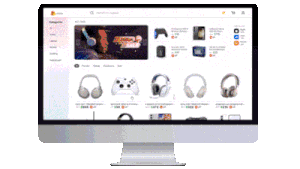

  <h2 align="center">💥 Teach Stack 💥</h2>

    
     
    

  
## 🎨 My creative toolbox 🧰
#### 🖥️ Languages & Frameworks:

JavaScript: 🌌 Node.js, 🚀 Express.js
Python: 🐍 Django, 🍜 Flask
Java: ☕ Spring Boot
🛠️ Tools & Platforms:

Frontend: 🎨 React, ⚛️ Vue, 🅰️ Angular
Database: 🐘 PostgreSQL, 🌱 MongoDB, 🚀 GraphQL
Version Control: 🌍 Git & 🐙 GitHub
🌐 Cloud & Deployment:

🚢 Docker
☁️ AWS & 🌩️ Azure
🤖 DevOps:

🧪 Travis CI, 🌀 Jenkins
🐳 Kubernetes
🔧 Editors & IDEs:

🆚 VS Code
💼 IntelliJ IDEA

## 💻 My work experience
Here are the some projects that I've build throughout my development journey:

 

 
<strong>View Projects</strong>🔎📚✨

<picture>
  <source media="(min-width: 1200px)" srcset="https://upload.wikimedia.org/wikipedia/commons/1/1d/No_image.svg">
 
</picture>
 
 - 🤖 **AI ChatBot**: _Because who needs real humans anyway?._ 🤷‍♂️
   - [Repo](https://github.com/vishal-gg/AI-ChatBot) | [Coming soon 🚀](#)

<picture>
  <source media="(max-width: 1200px)" srcset="https://upload.wikimedia.org/wikipedia/commons/1/1d/No_image.svg">
 
</picture>

- 🎬 **IMDb Clone**: _Because the original IMDb just wasn't enough for us._ 🦄😏
  - [Repo](https://github.com/vishal-gg/IMDb_Clone) | [Demo 🚀](https://getinternetmovies.vercel.app)

- 🛍️ **Amazon Clone**: _Why shop at the real Amazon when you could shop here?_ 😎✌
  - [Repo](https://github.com/vishal-gg/Amazon_Clone) | [Coming soon 🚀](#)

- 🍽️ **Restaurant App**: _In case you get hungry while coding._ 🌮🍜
  - [Repo](https://github.com/vishal-gg/Restaurant_App) | [Demo 🚀](https://eatopendoor.vercel.app)

- 🛒 **E-commerce**: _Yet another place to burn your salary._ 🔥🤑
  - [Repo](https://github.com/vishal-gg/E-Commerce) | [Demo 🚀](https://snapstore.vercel.app)

- 📁 **File Sharing App**: _Because sharing is caring, but mostly it's just faster this way._ 🤝⚡
  - [Repo](https://github.com/vishal-gg/File-Sharing-App--prod) | [Demo 🚀](https://snapsharefile.vercel.app)

- 🔍 **More Projects**: _See what else I've been working on._ 🛠️👨‍💻
  - [🔗 View All Repositories](https://github.com/vishal-gg?tab=repositories)

 

<picture>
  <source media="(max-width: 1050px)" srcset="https://upload.wikimedia.org/wikipedia/commons/1/1d/No_image.svg">
 
</picture>

## 🌐 Connect with me
If you're interested in collaboration or just want to chat:

- 📧 **Email**: [vishalkumarggv70@gmail.com](mailto:vishalkumarggv70@gmail.com)
- 🌐 **LinkedIn**: [vishalsah-webdev](https://www.linkedin.com/in/vishalsah-webdev)
- ❌ **Twitter**: [@handle](#)
- 📸 **Instagram**: [im.vishal_](#)
<picture>
  <source media="(min-width: 1050px)" srcset="https://upload.wikimedia.org/wikipedia/commons/1/1d/No_image.svg">
 
</picture>
  

## 📈 My github statistics
<table>
    <tr>
        <td align="center">
         <picture>
   <source media="(prefers-color-scheme: dark)" srcset="https://github-readme-stats.vercel.app/api?username=vishal-gg&show_icons=true&rank_icon=github&locale=en&&theme=codeSTACKr" />
   <source media="(prefers-color-scheme: light)" srcset="https://github-readme-stats.vercel.app/api?username=vishal-gg&show_icons=true&locale=en&&theme=default" />
   
 </picture>
        </td>
        <td rowspan="2" align="center">
         <picture>
   <source media="(prefers-color-scheme: dark)" srcset="https://github-readme-stats.vercel.app/api/top-langs?username=vishal-gg&show_icons=true&locale=en&theme=codeSTACKr"
      />
   <source media="(prefers-color-scheme: light)"srcset="https://github-readme-stats.vercel.app/api/top-langs?username=vishal-gg&show_icons=true&locale=en&theme=default"
      />
   
 </picture>
        </td>
    </tr>
    <tr>
        <td align="center">
         <picture>
   <source media="(prefers-color-scheme: dark)" srcset="https://github-readme-streak-stats.herokuapp.com/?user=vishal-gg&theme=codeSTACKr" />
   <source media="(prefers-color-scheme: light)" srcset="https://github-readme-streak-stats.herokuapp.com/?user=vishal-gg&theme=default" />
   
 </picture>
        </td>
    </tr>
    <tr>
        <td colspan="2" align="center">
        <picture>
  <source media="(prefers-color-scheme: dark)" srcset="https://raw.githubusercontent.com/vishal-gg/vishal-gg/output/github-snake-dark.svg" />
  <source media="(prefers-color-scheme: light)" srcset="https://raw.githubusercontent.com/vishal-gg/vishal-gg/output/github-snake.svg" />
  
</picture>
        </td>
    </tr>
</table>

© 2023 Creative Me, all rights reserved. Crafted with ❤️ for the love of coding.

https://github.com/vishal-gg

