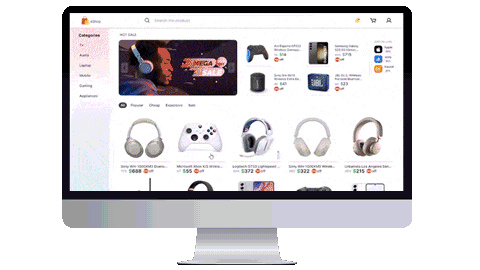

  <picture>
  <source media="(prefers-color-scheme: dark)" srcset="https://capsule-render.vercel.app/api?type=waving&color=gradient&height=100&section=header&text=Hi%20There!%20👋&fontSize=60">
   <source media="(prefers-color-scheme: light)" srcset="https://capsule-render.vercel.app/api?type=waving&color=gradient&height=100&section=header&text=Hi%20There!%20👋&fontSize=60&fontColor=000000">
  
  
  </picture>

  

 
 - 📢 I’m currently working on **Portfolio**
 
- 🌱 I’m currently learning **Modern web animations**
- 🤝 Looking for **Collaborations in front-end projects**

- 💬 Ask me about **React, Javascript.. or anything like why Eren started rumbling**

- ⚡ Fun fact **Beyond coding, video editing is my true passion.**
- 📞 How to reach me? **[click here](#-connect-with-me)**

## 🎨 My creative toolbox

  <h3 align="center">⚡ Tech Stack ⚡</h3>

    
     
    

## 💻 My work experience

Here are the some projects that I've build throughout my development journey:

 

 
<strong>View Projects</strong>🔎📚✨

<picture>
  <source media="(min-width: 1200px)" srcset="https://upload.wikimedia.org/wikipedia/commons/1/1d/No_image.svg">
 
</picture>
 
 - 🤖 **AI ChatBot**: _Because who needs real humans anyway?._ 🤷‍♂️
   - [Repo](https://github.com/vishal-gg/AI-ChatBot) | [Demo 🚀](https://yourchatbuddy.vercel.app)

<picture>
  <source media="(max-width: 1200px)" srcset="https://upload.wikimedia.org/wikipedia/commons/1/1d/No_image.svg">
 
</picture>

- 🎬 **IMDb Clone**: _Because the original IMDb just wasn't enough for us._ 🦄😏

  - [Repo](https://github.com/vishal-gg/IMDb_Clone) | [Demo 🚀](https://getinternetmovies.vercel.app)

- 🛍️ **Amazon Clone**: _Why shop at the real Amazon when you could shop here?_ 😎✌

  - [Repo](https://github.com/vishal-gg/Amazon_Clone) | [Demo 🚀](https://amazoncopy.vercel.app)

- 🍽️ **Restaurant App**: _In case you get hungry while coding._ 🌮🍜

  - [Repo](https://github.com/vishal-gg/Restaurant_App) | [Demo 🚀](https://eatopendoor.vercel.app)

- 🛒 **E-commerce**: _Yet another place to burn your salary._ 🔥🤑

  - [Repo](https://github.com/vishal-gg/E-Commerce) | [Demo 🚀](https://snapstore.vercel.app)

- 📁 **File Sharing App**: _Because sharing is caring, but mostly it's just faster this way._ 🤝⚡

  - [Repo](https://github.com/vishal-gg/File-Sharing-App--prod) | [Demo 🚀](https://snapsharefile.vercel.app)

- 🔍 **More Projects**: _See what else I've been working on._ 🛠️👨‍💻
  - [🔗 View All Repositories](https://github.com/vishal-gg?tab=repositories)

 

<picture>
  <source media="(max-width: 975px)" srcset="https://upload.wikimedia.org/wikipedia/commons/1/1d/No_image.svg">
 
</picture>

## 🌐 Connect with me

If you're interested in collaboration or just want to chat:

- 📧 **Email**: [vishalkumarggv70@gmail.com](mailto:vishalkumarggv70@gmail.com)
- 🔗 **LinkedIn**: [vishalsah-webdev](https://www.linkedin.com/in/vishalsah-webdev)
- ❌ **Twitter**: [@FirstMan1674698](https://x.com/FirstMan1674698?t=lbpU3uAJYOBOfX6E1pzULw&s=09)
- 📸 **Instagram**: [@im.vishal\_](https://instagram.com/im.vishal_?igshid=OGQ5ZDc2ODk2ZA==)
- 📱 **WhatsApp**: [click here](https://wa.me/qr/YH4ZYZZUZKZKN1) 
_⚠️ Note: whatsApp link only works with mobile._

  <picture>
    <source media="(min-width: 975px)" srcset="https://upload.wikimedia.org/wikipedia/commons/1/1d/No_image.svg">
   
  </picture>
    

## 📈 My github statistics

<table>
    <tr>
        <td align="center">
         <picture>
   <source media="(prefers-color-scheme: dark)" srcset="https://github-readme-stats.vercel.app/api?username=vishal-gg&show_icons=true&rank_icon=github&locale=en&&theme=codeSTACKr" />
   <source media="(prefers-color-scheme: light)" srcset="https://github-readme-stats.vercel.app/api?username=vishal-gg&show_icons=true&locale=en&&theme=default" />
   
 </picture>
        </td>
        <td rowspan="2" align="center">
         <picture>
   <source media="(prefers-color-scheme: dark)" srcset="https://github-readme-stats.vercel.app/api/top-langs?username=vishal-gg&show_icons=true&locale=en&theme=codeSTACKr"
      />
   <source media="(prefers-color-scheme: light)"srcset="https://github-readme-stats.vercel.app/api/top-langs?username=vishal-gg&show_icons=true&locale=en&theme=default"
      />
   
 </picture>
        </td>
    </tr>
    <tr>
        <td align="center">
         <picture>
   <source media="(prefers-color-scheme: dark)" srcset="https://github-readme-streak-stats.herokuapp.com/?user=vishal-gg&theme=codeSTACKr" />
   <source media="(prefers-color-scheme: light)" srcset="https://github-readme-streak-stats.herokuapp.com/?user=vishal-gg&theme=default" />
   
 </picture>
        </td>
    </tr>
    <tr>
        <td colspan="2" align="center">
        <picture>
  <source media="(prefers-color-scheme: dark)" srcset="https://raw.githubusercontent.com/vishal-gg/vishal-gg/output/github-snake-dark.svg" />
  <source media="(prefers-color-scheme: light)" srcset="https://raw.githubusercontent.com/vishal-gg/vishal-gg/output/github-snake.svg" />
  
</picture>
        </td>
    </tr>
    
</table>

© 2023 Creative Me, all rights reserved.  Crafted with ❤️

